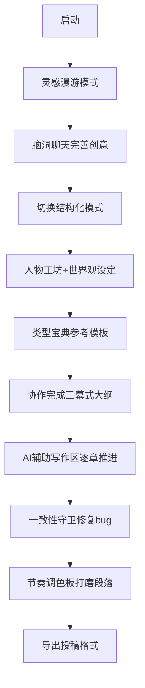

## 1. Product Overview
**墨灵**是一款会随着创作者一同成长的AI小说创作辅助工具。它不只是一个输入提示、输出文字的对话框，而是一位能从灵感到成稿全程陪伴、且越用越懂你的进化型创作搭档。核心目标是将AI的发散性与生成力，与作家的掌控感与判断力完美结合。

## 2. Core Features

### 2.1 User Roles
| Role | Registration Method | Core Permissions |
|------|---------------------|------------------|
| Writer | Local storage | Create, edit, save novels, train Skills |

### 2.2 Three Creative Modes
| Mode | Positioning | Core Value |
|------|-------------|------------|
| 灵感漫游模式 | 聊着天碰撞脑洞 | 无压力的创意起点，突破"不知道写什么" |
| 结构化创作模式 | 从大纲、人物到章节，逐步推进 | 严谨的工程化创作，确保长篇不崩 |
| 自由沙盒模式 | 完全手动控制，AI按需召唤 | 给资深作者最大的自由度和掌控感 |

### 2.3 Feature Modules

#### 3.1 灵感孵化室
- 脑洞聊天：输入模糊想法，AI以提问方式帮忙拓展
- "如果"生成器：用经典故事模板随机组合元素
- 热点/经典融合器：输入两个作品，AI生成融合新故事
- 核心创意提取器：上传随笔/梦境记录，提取核心冲突
- 类型宝典：内置悬疑、言情、科幻等类型故事引擎

#### 3.2 人物工坊
- 多维档案生成：输入标签自动生成完整人物档案
- 可视化关系网：图谱展示人物关系，预警性格冲突
- 内生小说引擎：模拟人物真实对话与心理活动
- 人物弧光追踪：标注人物成长变化，自动提醒停滞

#### 3.3 世界观/设定集
- 逻辑一致性守卫：记录设定规则，检测矛盾
- 交互式地图与编年史：可视化时间线和地图

#### 3.4 AI辅助写作区
- 动态大纲与回溯织网：插入伏笔时建议前文呼应
- 多维续写引擎：指定风格、参照、节奏生成续写
- 情感与节奏调色板：调整叙事节奏和情感浓度
- 伏笔与线索管理器：高亮标记伏笔，跟踪揭晓

#### 3.5 智能编辑与风格打磨
- 多语言/风格翻译器：模仿海明威、普鲁斯特等风格
- 信息密度调节器：浓缩或展开文字
- 对话抛光机：优化台词符合人物口癖
- 一致性守卫（终审）：扫描全文冲突

#### 3.6 项目管理与成长系统
- 分卷/分章管理：树状结构，拖拽调整顺序
- 创作日历与字数统计：每日目标，写作轨迹
- 版本历史与分支：关键修改存档，平行宇宙分支

#### 3.7 Skills进化技能系统
- 对白雕刻师、场景构建师、伏笔织网者、节奏鼓手、文风变奏者
- 行为即训练：用户选择/拒绝建议，系统隐式学习
- 星级评价与情绪标注：情感标签作为调参信号
- Skill-DNA图谱：记录技能激活、进化等级、风格指纹

## 3. Core Process

### 3.1 初次创作完整流程

### 3.2 Skills进化三阶段
| Stage | Status | Experience |
|-------|--------|------------|
| 初期（1-10章） | 主动训练期 | 频繁拖拽Skills，从多个结果挑选修改 |
| 中期（10-30章） | 默契协作期 | AI续写建议风格对味，简单指令即可 |
| 后期（30章后） | 灵犀直觉期 | AI主动提供建议，如伏笔呼应提醒 |

## 4. User Interface Design

### 4.1 Design Style
- **主色调**: 深邃墨蓝(#0f172a) + 鎏金色(#d4a574)
- **辅助色**: 书卷白(#f8fafc)、墨绿(#166534)、朱砂红(#991b1b)
- **按钮样式**: 圆角(12px)、渐变背景、悬停光晕效果
- **字体**: 思源宋体(正文)、Playfair Display(标题)、JetBrains Mono(代码)
- **布局**: 三栏布局（侧边导航+大纲面板+主编辑区）
- **图标**: Lucide图标库，水墨风格

### 4.2 Page Design Overview
| Page Name | Module Name | UI Elements |
|-----------|-------------|-------------|
| Dashboard | Novel List | Card layout with cover gradient, title, progress |
| Dashboard | Quick Start | Mode selector, one-click create |
| Idea Lab | Chat Area | Message bubbles, suggestion chips |
| Idea Lab | Generator | Input fields, result cards |
| Character Workshop | Character Cards | Portrait, traits, relationship graph |
| Writing Zone | Editor | Full-width text with line numbers |
| Writing Zone | Toolbar | Formatting, AI actions, Skills |
| Writing Zone | Outline Panel | Collapsible chapter hierarchy |
| Settings | AI Config | API key input, model selection |
| Settings | Skill Lab | Skill cards, evolution status |

### 4.3 Responsiveness
- Desktop-first design (1400px+)
- Collapsible side panels
- Focus mode with distraction-free writing

### 4.4 Theme
- Dark mode by default (保护写作视力)
- Light mode option
- Custom accent color support