## 1. Architecture Design

```mermaid
flowchart TB
    subgraph Desktop["Tauri Desktop App"]
        subgraph Frontend["React Application"]
            A[Dashboard]
            B[IdeaLab]
            C[CharacterWorkshop]
            D[WritingZone]
            E[WorldBuilder]
            F[Settings]
        end
        
        subgraph StateManagement["Zustand Store"]
            G[NovelStore]
            H[EditorStore]
            I[AIStore]
            J[SkillStore]
        end
        
        subgraph LocalStorage["IndexedDB"]
            K[Novels]
            L[Chapters]
            M[Characters]
            N[Settings]
            O[SkillDNA]
        end
    end
    
    subgraph ExternalServices["External Services"]
        P[OpenAI API]
        Q[Local File System]
    end
    
    A --> G
    B --> G
    B --> I
    C --> G
    D --> G
    D --> H
    D --> I
    E --> G
    F --> I
    F --> J
    
    G --> K
    G --> L
    G --> M
    J --> O
    I --> P
    
    style Desktop fill:#0f172a,stroke:#d4a574,stroke-width:2px
```


## 2. Technology Description
- **Framework**: Tauri@2 + React@18 + TypeScript
- **UI**: TailwindCSS@3 + Lucide React Icons
- **State Management**: Zustand
- **Local Storage**: IndexedDB (via localForage)
- **AI Service**: OpenAI API (gpt-4o-mini)
- **Build Tool**: Vite
- **Target Platforms**: Windows, macOS, Linux

## 3. Route Definitions
| Route | Purpose | Component |
|-------|---------|-----------|
| / | Dashboard - Novel list and quick actions | Dashboard |
| /idea-lab | Brainstorming and idea generation | IdeaLab |
| /editor/:novelId | Main writing editor | WritingZone |
| /editor/:novelId/characters | Character management | CharacterWorkshop |
| /editor/:novelId/world | Worldbuilding tools | WorldBuilder |
| /settings | Settings and AI config | Settings |

## 4. Core Data Types

```typescript
// Novel Structure
interface Novel {
  id: string;
  title: string;
  description: string;
  genre: string;
  coverGradient: string;
  creativeMode: 'idea' | 'structured' | 'sandbox';
  createdAt: string;
  updatedAt: string;
  wordCount: number;
  chapterCount: number;
}

// Chapter Structure
interface Chapter {
  id: string;
  novelId: string;
  title: string;
  content: string;
  order: number;
  wordCount: number;
  createdAt: string;
  updatedAt: string;
  versionHistory: ChapterVersion[];
}

interface ChapterVersion {
  timestamp: string;
  content: string;
}

// Character Structure
interface Character {
  id: string;
  novelId: string;
  name: string;
  description: string;
  avatar: string;
  traits: CharacterTrait[];
  backstory: string;
  goals: string[];
  flaws: string[];
  relationships: CharacterRelationship[];
  arc: CharacterArc;
}

interface CharacterTrait {
  name: string;
  value: string;
}

interface CharacterRelationship {
  targetId: string;
  type: 'friend' | 'enemy' | 'lover' | 'family' | 'mentor' | 'rival';
  description: string;
}

interface CharacterArc {
  act1: string;
  act2: string;
  act3: string;
  growth: number;
}

// Worldbuilding Structure
interface WorldSetting {
  id: string;
  novelId: string;
  category: string;
  key: string;
  value: string;
}

interface TimelineEvent {
  id: string;
  novelId: string;
  year: number;
  title: string;
  description: string;
}

// Skill System
interface Skill {
  id: string;
  name: string;
  icon: string;
  level: number;
  experience: number;
  description: string;
  promptTemplate: string;
  parameters: SkillParameter[];
  evolutionPath: SkillEvolution[];
}

interface SkillParameter {
  name: string;
  type: 'slider' | 'select' | 'text';
  default: string | number;
  options?: string[];
}

interface SkillEvolution {
  level: number;
  description: string;
  unlockedFeatures: string[];
}

interface SkillDNA {
  novelId: string;
  skills: Skill[];
  styleFingerprint: StylePreferences;
  usageHistory: SkillUsage[];
}

interface StylePreferences {
  preferredSentenceLength: 'short' | 'medium' | 'long';
  sensoryDetailLevel: number;
  dialogueStyle: 'direct' | 'subtextual' | 'lyrical';
  favoriteAuthors: string[];
}

interface SkillUsage {
  skillId: string;
  timestamp: string;
  rating: number;
  feedback: 'accept' | 'reject' | 'modify';
}

// AI Configuration
interface AIConfig {
  apiKey: string;
  model: string;
  temperature: number;
  maxTokens: number;
  topP: number;
}

// Plot Structure
interface PlotPoint {
  id: string;
  novelId: string;
  chapterId?: string;
  type: 'exposition' | 'inciting' | 'rising' | 'climax' | 'falling' | 'resolution';
  description: string;
  characterIds: string[];
}

interface Foreshadowing {
  id: string;
  novelId: string;
  chapterId: string;
  text: string;
  revealChapterId?: string;
  status: 'planted' | 'revealed' | 'forgotten';
}
```

## 5. Component Structure
```
src/
├── components/
│   ├── Layout/
│   │   ├── Sidebar.tsx
│   │   ├── Header.tsx
│   │   └── Layout.tsx
│   ├── Dashboard/
│   │   ├── NovelCard.tsx
│   │   ├── NovelGrid.tsx
│   │   ├── CreateNovelModal.tsx
│   │   └── ModeSelector.tsx
│   ├── IdeaLab/
│   │   ├── BrainstormChat.tsx
│   │   ├── WhatIfGenerator.tsx
│   │   ├── FusionGenerator.tsx
│   │   ├── CoreIdeaExtractor.tsx
│   │   └── GenreGuide.tsx
│   ├── CharacterWorkshop/
│   │   ├── CharacterCard.tsx
│   │   ├── CharacterForm.tsx
│   │   ├── RelationshipGraph.tsx
│   │   └── CharacterArcTracker.tsx
│   ├── WritingZone/
│   │   ├── TextEditor.tsx
│   │   ├── Toolbar.tsx
│   │   ├── AIPanel.tsx
│   │   ├── OutlinePanel.tsx
│   │   ├── RhythmPalette.tsx
│   │   └── ForeshadowingManager.tsx
│   ├── WorldBuilder/
│   │   ├── SettingEditor.tsx
│   │   ├── Timeline.tsx
│   │   └── ConsistencyGuard.tsx
│   ├── Settings/
│   │   ├── AISettings.tsx
│   │   ├── SkillLab.tsx
│   │   └── ExportSettings.tsx
│   └── Common/
│       ├── Button.tsx
│       ├── Modal.tsx
│       ├── Tooltip.tsx
│       └── LoadingSpinner.tsx
├── hooks/
│   ├── useNovelStore.ts
│   ├── useEditorStore.ts
│   ├── useAIStore.ts
│   └── useSkillStore.ts
├── utils/
│   ├── aiService.ts
│   ├── storage.ts
│   ├── helpers.ts
│   └── export.ts
├── types/
│   └── index.ts
├── App.tsx
└── main.tsx
```

## 6. AI Service Design

### 6.1 Prompt Templates

**Brainstorming Prompt:**
```typescript
const brainstormPrompt = `
You are a creative writing partner. Help expand this idea: {idea}
Ask probing questions to dig deeper. Provide 3 unexpected angles.
`;
```

**Character Generation Prompt:**
```typescript
const characterPrompt = `
Generate a detailed character based on: {tags}
Include:
- Childhood background
- Core motivation
- Secret flaw
- Unique quirk
- Inner conflict
`;
```

**Continuation Prompt:**
```typescript
const continuationPrompt = `
Continue this story from where it left off:
{context}

Style: {style}
Perspective: {character}
Pace: {pace}

Provide {count} different continuations with varying approaches.
`;
```

**Consistency Check Prompt:**
```typescript
const consistencyPrompt = `
Check these facts against the story:
{facts}

Story text:
{text}

List any inconsistencies.
`;
```

### 6.2 API Integration
- **Service**: OpenAI Chat Completions API
- **Endpoints**: /v1/chat/completions
- **Models**: gpt-4o-mini (default), gpt-4o (optional)
- **Streaming**: Support for real-time text generation

## 7. Storage Design

### 7.1 IndexedDB Structure
| Store | Key | Indexes |
|-------|-----|---------|
| novels | id | genre, updatedAt |
| chapters | id | novelId, order |
| characters | id | novelId, name |
| worldSettings | id | novelId, category |
| timelineEvents | id | novelId, year |
| skillDNA | novelId | novelId |
| aiConfig | id | id |

### 7.2 Data Flow
1. App loads → Read all data from IndexedDB
2. User actions → Update Zustand stores
3. Store changes → Auto-sync to IndexedDB
4. AI requests → Direct API calls with local API key

## 8. Security Considerations
- API keys stored locally in IndexedDB (encrypted)
- All data stays on user's device
- No server-side storage for privacy
- Tauri's secure local file access
- Content Security Policy enforced

## 9. Performance Optimizations
- Lazy loading of components
- Virtual scrolling for long lists
- Debounced auto-save
- Compressed local storage
- Efficient state management

## 10. Build Configuration

### 10.1 Tauri Configuration
- Window size: 1400x900
- Resizable: true
- Fullscreen support
- Custom title bar

### 10.2 Target Platforms
- Windows: NSIS installer
- macOS: DMG package
- Linux: AppImage / DEB